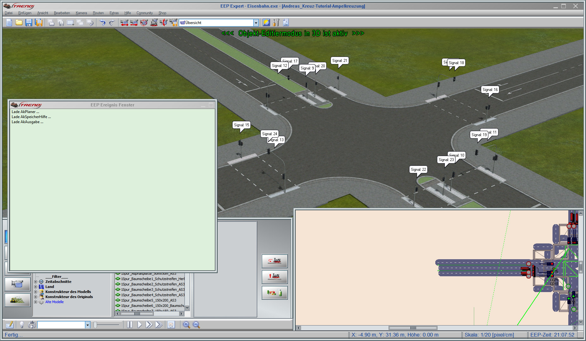
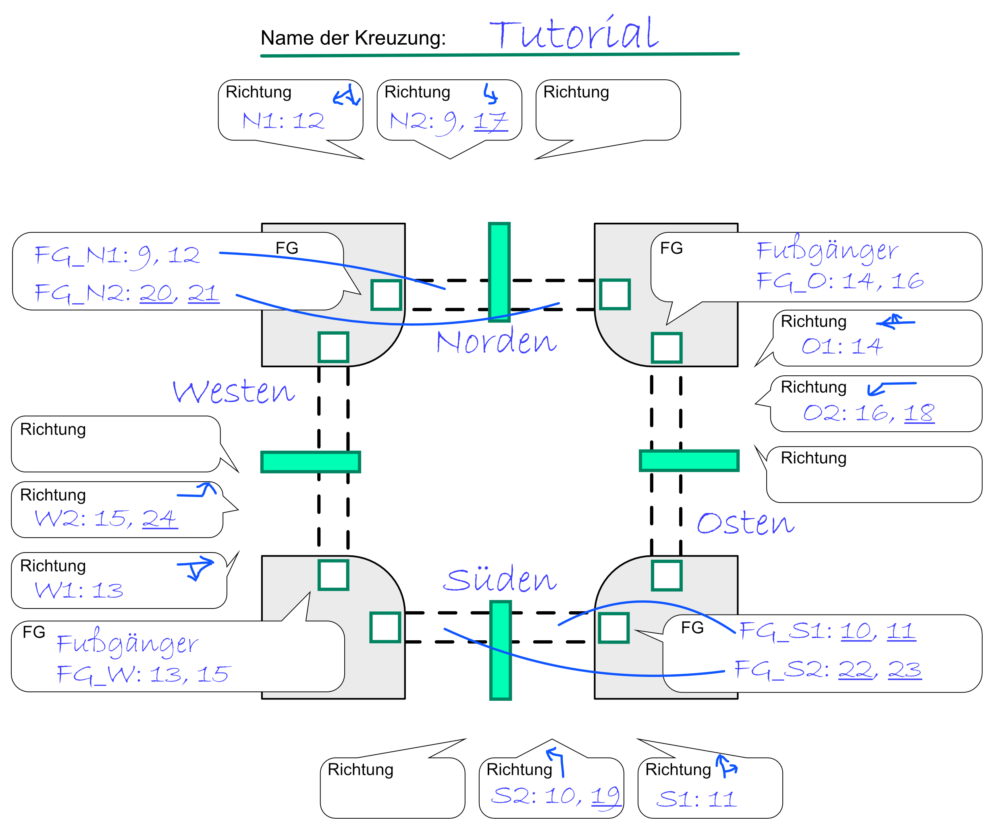

# Ampelkreuzung automatisch steuern

<p class="lead"> Diese Anleitung zeigt Dir, wie Du in EEP eine mit Ampeln versehene Kreuzung mit dem Skript verdrahten kannst.</p>

<hr>

Dafür benötigst Du folgendes:

* **EEP 14** und einen **Editor für Lua-Skripte** Deiner Wahl, z.B. Notepad++
* **Zettel und Stift** - z.B.: [_Kreuzungsaufbau.pdf_](../assets/Kreuzungsaufbau.pdf)
* Die **Anlage Andreas_Kreuz-Tutorial-Ampelkreuzung.anl3** ([_Download_](https://github.com/Andreas-Kreuz/ak-lua-skripte-fuer-eep/releases))
  <br>Für den Betrieb dieser Anlage brauchst Du folgende **Modelle**:

  | 1Spur-Großstadtstraßen-System-Grundset (V10NAS30002)  | _[Download](https://eepshopping.de/1spur-gro%C3%83%C6%92%C3%82%C5%B8stadtstra%C3%83%C6%92%C3%82%C5%B8en-system-grundset%7C7656.html)_  |
  | 1Spur-Ergänzungsset  | _[Download](https://www.eepforum.de/filebase/file/215-freeset-zu-meinem-1spur-strassensystem/)_  |
  | Ampel-Baukasten für mehrspurige Straßenkreuzungen (V80NJS20039) | _[Download](https://eepshopping.de/ampel-baukasten-f%C3%83%C6%92%C3%82%C2%BCr-mehrspurige-stra%C3%83%C6%92%C3%82%C5%B8enkreuzungen%7C6624.html)_ |
  | Straßenbahnsignale als Immobilien (V80MA1F010 und V10MA1F011) | _[Download](https://eepshopping.de/ampel-baukasten-f%C3%83%C6%92%C3%82%C2%BCr-mehrspurige-stra%C3%83%C6%92%C3%82%C5%B8enkreuzungen%7C6624.html)_ |

:star: **_Tipp_**: Die notwendigen Skripte sind bei der Installation in der Anlage enthalten. Möchtest Du Deine eigene Anlage verwenden, so kannst Du die Skripte wie folgt installieren: [_Installation von "Ak-Lua-Skripte-für-EEP"_](../anleitungen-anfaenger/installation)

# Los geht's
* Öffne die Anlage in EEP
* Öffne Deinen Editor für Lua-Skripte

## Das Lua-Hauptskript anlegen
:star: _**Tipp:** Aktiviere in EEP unter Programmeinstellungen das EEP Ereignisfenster, damit Du die Lua Meldungen lesen kannst._

:exclamation: _**Beachte:** Diese Anleitung geht davon aus, dass in der geöffneten Anlage noch nichts mit LUA gemacht wurde. Verwendest Du Dein eigenes Anlagen-Skript, dann lösche es nicht, sondern ergänze es um die weiter unten aufgeführten Befehle._

<br>

* Das Hauptskript `meine-ampel-main.lua` wirst Du im nächsten Schritt im LUA-Verzeichnis von EEP anlegen: `C:\Trend\EEP14\LUA`

* Öffne den LUA-Editor in EEP, wähle alles mit `<Strg>` + `<A>` aus und ersetze es durch
  ```lua
  clearlog()
  require("meine-ampel-main")
  ```

* Klicke in EEP auf _"Skript neu laden"_ und wechsle in den 3D-Modus. <br>:smiley: **Wenn Du alles richtig gemacht hast**, erscheint im Log eine Fehlermeldung, dass `meine-ampel-main.lua` nicht gefunden werden kann.

    

<br>

* Lege nun das Haupt-Skript an `C:\Trend\EEP14\LUA\meine-ampel-main.lua` im Verzeichnis `LUA` an

    Dies wird das Skript werden, welches in der Anlage verwendet wird. Egal, wie Deine Anlage heißt.

* Klicke in EEP auf _"Skript neu laden"_ und wechsle in den 3D-Modus. <br>:smiley: **Wenn Du alles richtig gemacht hast**, erscheint eine Fehlermeldung, dass `meine-ampel-main.lua` nicht gefunden werden kann.

    


## Notwendige Befehle in das Lua-Skript aufnehmen

* Ergänze das Lua-Hauptskript um die folgenden Zeilen.
  ```lua
  require("ak.strasse.AkStrasse")

  -- Hier kommt der Code

  function EEPMain()
      AkKreuzung:planeSchaltungenEin()
      AkPlaner:fuehreGeplanteAktionenAus()
      return 1
  end
  ```

* Klicke in EEP auf _"Skript neu laden"_ und wechsle in den 3D-Modus. <br>:smiley: **Wenn Du alles richtig gemacht hast**, verschwindet die Fehlermeldung

    

**Was ist grade passiert?**
* Die Zeile `require("ak.strasse.AkStrasse")` sorgt dafür, daß die Datei `ak/strasse/AkStrasse.lua` einmal eingelesen wird. Nach diesem Aufruf stehen Dir alle Funktionen dieser Datei zur Verfügung.
* Die Zeile `AkKreuzung:planeSchaltungenEin()` ist für das Einplanen aller Schaltvorgänge der Kreuzungen notwendig. Diese Vorgänge werden als Aktionen im Planer hinterlegt.
* Die Zeile `AkPlaner:fuehreGeplanteAktionenAus()` ist für das Ausführen aller geplanten Aktionen notwendig.
* Wichtig ist auch, dass die Funktion EEPMain mit `return 1` beendet wird, damit sie alle 200 ms aufgerufen wird.


## Alle Signale mit Tipp-Text markieren
Um die Signale (in dem Fall Ampeln) der Kreuzung zu bearbeiten ist es am einfachsten, wenn Du die Signal-IDs aller Signale in Tipp-Texten anzeigst.
In diesem Schritt läßt Du Dir von `AkStrasse` alle Signal-IDs in 3D anzeigen.

:exclamation: _**Beachte:** Verwende diesen Code nicht, wenn Du in Deiner Anlagen selbst Tipp-Texte mit `EEPShowSignalInfo(...)` an Deinen Signalen anzeigst. Denn all diese Tipp-Texte werden gelöscht._

* Um die Tipp-Texte anzuzeigen, füge die folgenden beiden Zeilen vor der EEPMain()-Methode hinzu:
  ```lua
  -- Hier kommt der Code
  AkKreuzung.zeigeSignalIdsAllerSignale = true
  AkKreuzung.zeigeSchaltungAlsInfo = true
  ```
* Klicke in EEP auf _"Skript neu laden"_ und wechsle in den 3D-Modus. <br>:smiley: **Wenn Du alles richtig gemacht hast**, siehst Du an allen Signalen Tipp-Texte mit den IDs dieser Signale.

    

__Was ist grade passiert?__
  * Das neu Laden der Anlage hat dafür gesorgt, dass das Skript `AkStrasse` anhand der Variablen erkannt hat, dass es für alle Signale von 1 bis 1000 deren Signal-ID als Tipp-Text einblenden soll.

## Die Richtungen und Signal-IDs der Kreuzung notieren
_**Tipp:** Das [PDF-Dokument Kreuzungsaufbau.pdf](../assets/Kreuzungsaufbau.pdf) hilft Dir deine Kreuzung zu notieren._

Notiere Dir, welche _Richtungen_ es gibt und wie die IDs der zu schaltenden Ampeln heißen - merke Dir dabei, welche unterschiedlichen Ampelmodelle eingesetzt werden. In der Beispielanlage sind es:
  * Kombinierte Fußgänger- und Strassenverkehrsampeln
  * Reine Fußgängerampeln _(die sind in der Skizze bei "FG" unterstrichen)_
  * Strassenverkehrsampeln _(die sind in der Skizze bei "Richtung" unterstrichen)_



**Was ist eine _Richtung_**: In diesem Abschnitt wird viel von _Richtungen_ geredet. So eine _Richtung_ fasst mehrere Fahrspuren, die den selben Weg nehmen zusammen und schaltet alle Ampeln, die diesen Weg freigeben.
* **Fasse mehrere Fahrspuren in die den selben Weg nehmen immer zu einer _Richtung_ zusammen** (also mehrere Linksabbieger-, Geradeaus- **oder** Rechtsabbieger-Spuren), denn Spuren in die selbe _Richtung_ werden immer gemeinsam geschaltet.
* **Erstelle immer eigene Fahrspuren und _Richtungen_ für Linksabbieger, denn diese achten nicht auf den Gegenverkehr**. Darum solltest Du den Linksabbieger-Fahrspuren immer eine eigene _Richtung_ geben und diese nur dann auf grün schalten, wenn der Gegenverkehr den Fahrweg der Linksabbieger nicht kreuzen kann.
	* **Alternative:** Du kannst auch mit unsichtbaren Ampeln arbeiten, die bei Gegenverkehr auf rot schalten. Dies musst Du jedoch selbst machen.
* **Du kannst getrennte Rechtsabbieger-Fahrspuren und Geradeaus-Fahrspuren zu einer _Richtung_ zusammenfassen.**
* Spendiere Deinen Fußgängerampeln eigene _Richtungen_, denn diese werden von der Automatik eher auf rot geschaltet.

Erst im nächsten Schritt werden mehrere dieser _Richtungen_ zu Schaltungen zusammengefasst.

## Schreibe die Richtungen in das Haupt-Skript
:star: _**Tipp:** Für jede Ampel musst Du den Typ_ `AkAmpelModell` _kennen, da sich die Signalstellungen in EEP unterscheiden. Weitere Informationen findest Du unter: [Unterstütze weitere Ampeln in AkAmpelModell](../LUA/ak/strasse/)_

Schreibe nun die einzelnen Richtungen in das Haupt-Skript. Jede Richtung muss dabei eine noch nicht verwendete Speicher-ID zwischen 1 und 1000 bekommen.

```lua
-------------------------------------------------------------------------------
-- Definiere die Richtungen fuer die Kreuzung
-------------------------------------------------------------------------------

--   +---------------------------------------------- Neue Richtung
--   |              +------------------------------- Name der Richtung
--   |              |     +------------------------- Speicher ID - um die Anzahl der Fahrzeuge
--   |              |     |                                        und die Wartezeit zu speichern
--   |              |     |      +------------------ neue Ampel für diese Richtung
--   |              |     |      |           +------ Signal-ID dieser Ampel
--   |              |     |      |           |   +-- Modell kann rot, gelb, gruen und FG schalten
n1 = AkRichtung:neu("N1", 100, { AkAmpel:neu(12, AkAmpelModell.JS2_3er_mit_FG) })

-- Die Richtung N2 hat zwei Ampeln fuer's Linksabbiegen, 9 mit Fussgaengerampel und 17 ohne
n2 = AkRichtung:neu("N2", 101, {
    AkAmpel:neu(9, AkAmpelModell.JS2_3er_mit_FG),
    AkAmpel:neu(17, AkAmpelModell.JS2_3er_ohne_FG)
})

-- Die Richtungen für Fussgaenger haben auch je zwei Ampeln
fg_n1 = AkRichtung:neu("FG_N1", 102, {
    AkAmpel:neu(9, AkAmpelModell.JS2_3er_mit_FG), -- Wird geteilt mit N2
    AkAmpel:neu(12, AkAmpelModell.JS2_3er_mit_FG) -- Wird geteilt mit N1
})
fg_n2 = AkRichtung:neu("FG_N2", 103, {
    AkAmpel:neu(20, AkAmpelModell.JS2_2er_nur_FG),
    AkAmpel:neu(21, AkAmpelModell.JS2_2er_nur_FG),
})

-- Richtungen im Osten
o1 = AkRichtung:neu("O1", 100, { AkAmpel:neu(14, AkAmpelModell.JS2_3er_mit_FG) })
o2 = AkRichtung:neu("O2", 100, {
    AkAmpel:neu(16, AkAmpelModell.JS2_3er_mit_FG),
    AkAmpel:neu(18, AkAmpelModell.JS2_3er_ohne_FG)
})
fg_o = AkRichtung:neu("FG_O", 102, {
    AkAmpel:neu(14, AkAmpelModell.JS2_3er_mit_FG), -- Wird geteilt mit O1
    AkAmpel:neu(18, AkAmpelModell.JS2_3er_mit_FG) -- Wird geteilt mit O2
})

-- Richtungen im Sueden
s1 = AkRichtung:neu("S1", 100, { AkAmpel:neu(11, AkAmpelModell.JS2_3er_mit_FG) })
s2 = AkRichtung:neu("S2", 101, {
    AkAmpel:neu(10, AkAmpelModell.JS2_3er_mit_FG),
    AkAmpel:neu(19, AkAmpelModell.JS2_3er_ohne_FG)
})
fg_s1 = AkRichtung:neu("FG_S1", 102, {
    AkAmpel:neu(10, AkAmpelModell.JS2_3er_mit_FG), -- Wird geteilt mit S2
    AkAmpel:neu(11, AkAmpelModell.JS2_3er_mit_FG) -- Wird geteilt mit S1
})
fg_s2 = AkRichtung:neu("FG_S2", 103, {
    AkAmpel:neu(22, AkAmpelModell.JS2_2er_nur_FG),
    AkAmpel:neu(23, AkAmpelModell.JS2_2er_nur_FG),
})

-- Richtungen im Westen
w1 = AkRichtung:neu("W1", 100, { AkAmpel:neu(13, AkAmpelModell.JS2_3er_mit_FG) })
w2 = AkRichtung:neu("W2", 100, {
    AkAmpel:neu(15, AkAmpelModell.JS2_3er_mit_FG),
    AkAmpel:neu(24, AkAmpelModell.JS2_3er_ohne_FG)
})
fg_w = AkRichtung:neu("FG_W", 102, {
    AkAmpel:neu(13, AkAmpelModell.JS2_3er_mit_FG), -- Wird geteilt mit O1
    AkAmpel:neu(15, AkAmpelModell.JS2_3er_mit_FG) -- Wird geteilt mit O2
})
```

* Klicke in EEP auf _"Skript neu laden"_ und wechsle in den 3D-Modus. <br> :smiley: **Wenn Du alles richtig gemacht hast**, siehst Du weiterhin an allen Signalen Tipp-Texte mit den IDs dieser Signale und keine Fehlermeldung im Log.

__Was ist grade passiert?__
  * Du hast soeben die Richtungen der Kreuzung festgelegt. Jede kann für sich allein geschaltet werden oder zusammen mit anderen Richtungen. Dazu dient `AkKreuzungsSchaltung`, welches im nächsten Schritt zum Einsatz kommt.

## Fasse die Richtungen nun zu Schaltungen zusammen

Eine _Schaltung_ legt fest, welche _Richtungen_ gleichzeitig "grün" bekommen sollen. An einer Kreuzung ist immer nur eine Schaltung aktiv. Bevor eine neue Schaltung aktiv werden kann und die Richtungen auf "grün" schaltet, werden alle alten Richtungen, die in der neuen Schaltung nicht mehr enthalten sind auf rot geschaltet.

:exclamation: _**Beachte**: Eine **Schaltung** darf nur **Richtungen** enthalten, die sich nicht gegenseitig überlappen._

Notiere Dir nun, welche der _Richtungen_ zu _Schaltungen_ zusammengefasst werden sollen.


:star: _**Tipp**: Wichtig ist, das alle Richtungen in einer Schaltung enthalten sind.
Im Beispiel siehst Du, dass Richtungen in mehreren Schaltungen enthalten sein können.
Es würde jedoch genügen, entweder die Schaltungen 1 bis 4 oder die Schaltungen 5 bis 8 zu verwenden, da in diesen jeweils alle Richtungen enthalten sind._

## Schreibe die Schaltungen in das Haupt-Skript

```lua
--------------------------------------------------------------
-- Definiere die Schaltungen und die Kreuzung
--------------------------------------------------------------
-- Eine Schaltung bestimmt, welche Richtungen gleichzeitig auf
-- grün geschaltet werden dürfen, alle anderen sind rot

--- Tutorial 1: Schaltung 1
local sch1 = AkKreuzungsSchaltung:neu("Schaltung 1")
sch1:fuegeRichtungHinzu(n1)
sch1:fuegeRichtungHinzu(s1)
sch1:fuegeRichtungFuerFussgaengerHinzu(fg_o)
sch1:fuegeRichtungFuerFussgaengerHinzu(fg_w)

--- Tutorial 1: Schaltung 2
local sch2 = AkKreuzungsSchaltung:neu("Schaltung 2")
sch2:fuegeRichtungHinzu(n2)
sch2:fuegeRichtungHinzu(s2)
sch2:fuegeRichtungFuerFussgaengerHinzu(fg_n2)
sch2:fuegeRichtungFuerFussgaengerHinzu(fg_o)
sch2:fuegeRichtungFuerFussgaengerHinzu(fg_w)
sch2:fuegeRichtungFuerFussgaengerHinzu(fg_s2)

--- Tutorial 1: Schaltung 3
local sch3 = AkKreuzungsSchaltung:neu("Schaltung 3")
sch3:fuegeRichtungHinzu(o1)
sch3:fuegeRichtungHinzu(w1)
sch3:fuegeRichtungFuerFussgaengerHinzu(fg_n1)
sch3:fuegeRichtungFuerFussgaengerHinzu(fg_n2)
sch3:fuegeRichtungFuerFussgaengerHinzu(fg_s1)
sch3:fuegeRichtungFuerFussgaengerHinzu(fg_s2)

--- Tutorial 1: Schaltung 4
local sch4 = AkKreuzungsSchaltung:neu("Schaltung 4")
sch4:fuegeRichtungHinzu(o2)
sch4:fuegeRichtungHinzu(w2)
sch4:fuegeRichtungFuerFussgaengerHinzu(fg_n1)
sch4:fuegeRichtungFuerFussgaengerHinzu(fg_s1)

--- Tutorial 1: Schaltung 5
local sch5 = AkKreuzungsSchaltung:neu("Schaltung 5")
sch5:fuegeRichtungHinzu(n1)
sch5:fuegeRichtungHinzu(n2)
sch5:fuegeRichtungFuerFussgaengerHinzu(fg_w)

--- Tutorial 1: Schaltung 6
local sch6 = AkKreuzungsSchaltung:neu("Schaltung 6")
sch6:fuegeRichtungHinzu(o1)
sch6:fuegeRichtungHinzu(o2)
sch6:fuegeRichtungFuerFussgaengerHinzu(fg_n1)
sch6:fuegeRichtungFuerFussgaengerHinzu(fg_n2)
sch6:fuegeRichtungFuerFussgaengerHinzu(fg_s1)

--- Tutorial 1: Schaltung 7
local sch7 = AkKreuzungsSchaltung:neu("Schaltung 7")
sch7:fuegeRichtungHinzu(s1)
sch7:fuegeRichtungHinzu(s2)
sch7:fuegeRichtungFuerFussgaengerHinzu(fg_o)

--- Tutorial 1: Schaltung 6
local sch8 = AkKreuzungsSchaltung:neu("Schaltung 8")
sch8:fuegeRichtungHinzu(o1)
sch8:fuegeRichtungHinzu(o2)
sch8:fuegeRichtungFuerFussgaengerHinzu(fg_n1)
sch8:fuegeRichtungFuerFussgaengerHinzu(fg_s1)
sch8:fuegeRichtungFuerFussgaengerHinzu(fg_s2)


k1 = AkKreuzung:neu("Tutorial 1")
k1:fuegeSchaltungHinzu(sch1)
k1:fuegeSchaltungHinzu(sch2)
k1:fuegeSchaltungHinzu(sch3)
k1:fuegeSchaltungHinzu(sch4)
k1:fuegeSchaltungHinzu(sch5)
k1:fuegeSchaltungHinzu(sch6)
k1:fuegeSchaltungHinzu(sch7)
k1:fuegeSchaltungHinzu(sch8)
```

* Klicke in EEP auf _"Skript neu laden"_ und wechsle in den 3D-Modus. <br>:smiley: **Wenn Du alles richtig gemacht hast**, siehst Du plötzlich, dass die Schaltungen zum Leben erwachen.

    

__Was ist grade passiert?__
  * Du hast soeben die Richtungen zu Schaltungen zusammengefasst und diese einer Kreuzung zugewiesen. Durch die beiden am Anfang hinzugefügten Aufrufe in EEPMain() plant die Kreuzung automatisch ihre Schaltungen der Planer führt sie aus.

## Schalte die Hilfsfunktionen wieder aus

Erinnerst Du Dich den Code, der die Tipp-Texte zu den Signalen hinzugefügt hat?
* Wenn Du möchtest, kannst Du die Tipp-Texte wieder abschalten. Entferne nicht die Zeilen, sondern setze die Werte von `true` auf `false`.

	```lua
  -- Hier kommt der Code
  AkKreuzung.zeigeSignalIdsAllerSignale = false
  AkKreuzung.zeigeSchaltungAlsInfo = false
	```

* Klicke danach auf Skript neu laden und wechsle in den 3D-Modus.<br>:smiley: **Wenn Du alles richtig gemacht hast**, verschwinden die Tipp-Texte von den Signalen.

**Tipp**: Setze die Werte wieder auf `true`, wenn Du denkst, dass Du die Signale falsch gesetzt hast.


# Geschafft
Du hast diese Anleitung abgeschlossen :four_leaf_clover:

**So kannst Du weitermachen**
* Füge noch fehlende Richtungen zu Schaltungen hinzu:
	* Wenn `n2` geschaltet ist, kann immer auf `fg_n2` geschaltet werden.
	* Wenn `s2` geschaltet ist, kann immer auf `fg_s2` geschaltet werden.

**Tipps**
* [Ampeln aufstellen](Ampel-aufstellen)


**Weitere Themen**
* Füge Kontaktpunkte und Zähler hinzu
* Füge Richtungen hinzu, die nur auf Anforderung geschaltet werden
